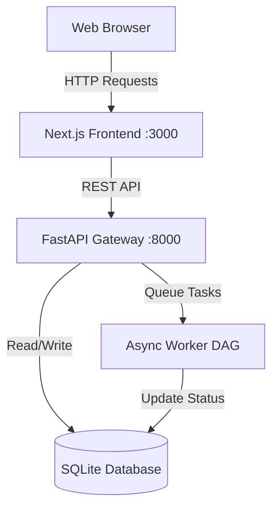
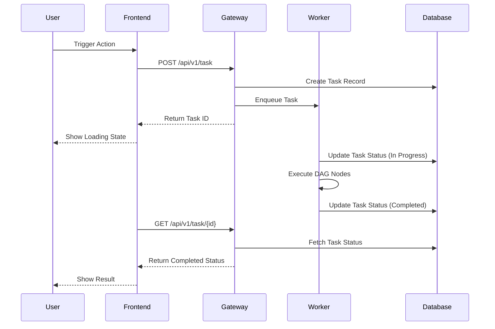

# ForgeAI Engine & Frontend Implementation Plan

## Goal Description
The goal is to develop and deploy the ForgeAI Engine, a system with a Next.js frontend and a FastAPI backend that handles task execution through an in-process async worker DAG, backed by a SQLite database. This plan covers the architecture, component interaction, and deployment steps.

## System Architecture

The architecture consists of three main components:
1. **Frontend**: A Next.js web application.
2. **Gateway/Backend**: A FastAPI application that serves as the entry point for API requests.
3. **Database & Workers**: An SQLite database for data persistence and an in-process async worker DAG for task execution.

## Component Details

### 1. Frontend (Next.js)
- Modern UI for user interactions.
- Communicates with the FastAPI Gateway.

### 2. Backend Gateway (FastAPI)
- Handles incoming API requests.
- Validates data and manages sessions.
- Triggers async worker tasks.

### 3. Task Execution DAG
- Manages complex task execution workflows.
- Updates task states in the SQLite database.

## Proposed Changes
- [x] Initial setup of Next.js frontend.
- [x] Initial setup of FastAPI gateway.
- [x] Integration of SQLite and initial schema.
- [x] Basic DAG worker setup in `backend/orchestrator/workers/codegen_worker.py`.

## Verification Plan

### Automated Tests
- Run `pytest` for backend API endpoints and worker logic.
- E2E testing using `test_e2e_local.py`.

### Manual Verification
- Start the local development server using `python run_local.py`.
- Verify the frontend is accessible at `http://localhost:3000`.
- Verify the API gateway and documentation are accessible at `http://localhost:8000/docs`.
- Test task submission from the UI and verify database updates.
